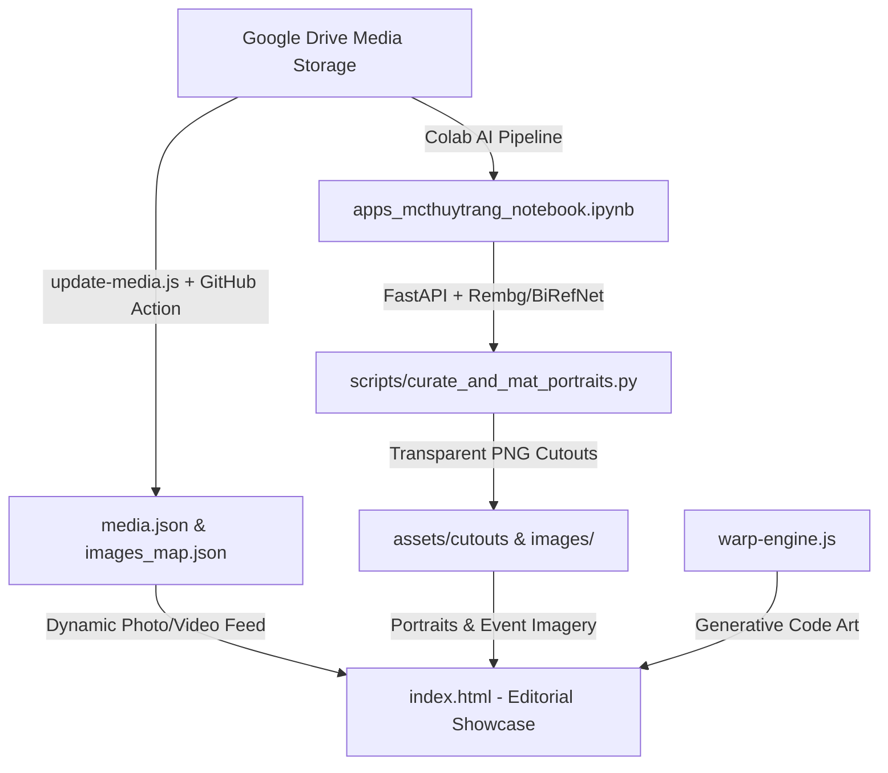

# MC Thùy Trang (Trang Naria) — Editorial Showcase & AI Media Pipeline

[](https://github.com/Banhkun/mcthuytrang/actions/workflows/update-media.yml)
[](LICENSE)

An editorial portfolio and automated media pipeline for **MC Thùy Trang (Trang Naria)** — Bilingual MC, Television Host, Talk Show Host, and Voice Talent.

This codebase combines an A4 Landscape Editorial Magazine web experience with a remote Google Colab GPU-powered portrait matting pipeline and automated Google Drive synchronization.

---

## 📖 Agent & Developer Architecture Guide

For agents or developers navigating this codebase, the project is divided into three core subsystems:



---

## 🗂️ Codebase Map & Directory Structure

```text
mcthuytrang/
├── index.html                       # Primary presentation: A4 Landscape Editorial Magazine
├── mcthuytrangportfolio.html        # Alternate layout: Expanded gallery portfolio
├── style.css                        # Global tokens, typography, and utility classes
├── warp-engine.js                   # Generative canvas engine (Liquid Gold, Particle Flow, Aura)
│
├── apps_mcthuytrang_notebook.ipynb  # Colab GPU backend (FastAPI, Rembg BiRefNet, MQS matting)
│
├── scripts/                         # Local Python & PowerShell automation tooling
│   ├── colab_client.py              # HTTP client for the Colab Cloudflare tunnel
│   ├── curate_and_mat_portraits.py  # Batch portrait processing and alpha refinement
│   ├── fetch_curated_cutouts.py     # Downloads transparent PNG cutouts from Colab
│   ├── filter_potential_portraits.py# Face detection & portrait scoring heuristics
│   ├── scan_all_portraits.py        # Recursive Google Drive folder indexer
│   └── set_colab_url.ps1            # Updates active Cloudflare tunnel URL
│
├── .github/workflows/
│   └── update-media.yml             # Scheduled GitHub Action running update-media.js
├── update-media.js                  # Node.js script querying Google Drive API v3
├── media.json                       # Synced photo & video manifest from Google Drive
├── images_map.json                  # Mapping between event photo names and Drive file IDs
├── all_drive_portraits_catalog.json # Metadata index of raw photos on Google Drive
├── curated_potential_portraits.json # Filtered portrait candidates selected for matting
│
├── assets/                          # Static assets and media files
│   ├── cutouts/                     # Transparent PNG cutouts generated via BiRefNet
│   ├── drive_photos/                # Cached high-resolution event photos
│   └── raw_danone/                  # Danone/Aptamil customer conference photo set
│
├── profile_mc_thuy_trang.pdf        # Original profile presentation document (PDF)
├── slides_content_report.txt        # Extracted slide text and editorial copy
└── package.json                     # Node.js dependency definition & npm update script
```

---

## 🎨 Subsystem 1: Frontend & Editorial Magazine

- **Primary Entrypoint**: `index.html`
- **Design Inspiration**: High-fashion print magazine meets modern digital interactive presentation.
- **Canva Color Formula**:
  - Sky Blue: `#4bb5e8` (`--canva-sky`)
  - Warm Cream: `#fae8b4` (`--canva-cream`)
  - Deep Navy: `#152c5b` (`--navy-blue`)
  - Off-white Cream: `#fbf8f1` (`--canva-cream-bg`)
- **Key Features**:
  - **A4 Landscape Layout**: Tailored for both desktop 16:9 viewing and exact 1:1 print/PDF export (`@media print`).
  - **Floating Magazine HUD**: Top navigation bar with quick jumps (`#slide-hero`, `#slide-about`, `#slide-awards`, `#slide-bilingual`, `#slide-events`, `#slide-rates`).
  - **Generative Art Engine (`warp-engine.js`)**: Interactive HTML5 canvas overlay with real-time liquid gold particle physics, cursor attraction, and smooth animation loops.

---

## ⚡ Subsystem 2: Google Colab AI Matting Pipeline

Located in **`apps_mcthuytrang_notebook.ipynb`**:
- **Hardware Target**: Google Colab T4 or A100 GPU (`accelerator: GPU`).
- **Core Stack**:
  - `FastAPI` + `uvicorn` running asynchronously via `nest_asyncio`.
  - Matting model chain: `birefnet-portrait` $\rightarrow$ `birefnet-general` $\rightarrow$ `isnet-general-use`.
  - Alpha refinement: `pymatting.estimate_foreground_ml` edge decontamination + smoothstep thresholding.
  - **Mask Quality Score (MQS)**: Heuristic scoring algorithm assessing fringe halos, hole artifacts, and speckle noise.
  - Tunneling: Exposes endpoints to the local machine via Cloudflare Tunnel (`cloudflared`) or `pyngrok`.
- **API Endpoints**:
  - `GET /list?folder=...`: List subfolders and raw photos in Drive.
  - `POST /cutout-drive`: Fetches a photo from Drive, runs the model chain, decontaminates edges, crops transparent margins, and returns a transparent PNG.
  - `POST /montage-drive`: Generates composite preview montages.

---

## 🔄 Subsystem 3: Automated Media Synchronization

Located in **`update-media.js`** & **`.github/workflows/update-media.yml`**:
- **Cron Schedule**: Runs weekly or on demand (`workflow_dispatch`).
- **Functionality**:
  1. Authenticates against Google Drive API v3 using `GOOGLE_DRIVE_API_KEY`.
  2. Queries `IMAGES_FOLDER_ID` and `VIDEOS_FOLDER_ID`.
  3. Formats entries and updates `media.json`.
  4. Automatically commits and pushes changes back to GitHub if new assets are detected.

---

## 🚀 Local Development Setup

### 1. Run the Web Application
No build step or framework required (Vanilla HTML5/CSS3/JavaScript):

```bash
# Using Python
python -m http.server 8080

# Or using Node.js / npx
npx serve .
```
Open [http://localhost:8080](http://localhost:8080) in your browser.

### 2. Update Media from Google Drive Manually
```bash
npm install
npm run update
```
*(Requires `GOOGLE_DRIVE_API_KEY`, `IMAGES_FOLDER_ID`, and `VIDEOS_FOLDER_ID` in your environment).*

### 3. Connect to the Colab GPU Server
1. Open `apps_mcthuytrang_notebook.ipynb` in [Google Colab](https://colab.research.google.com).
2. Go to **Runtime $\rightarrow$ Change runtime type $\rightarrow$ T4 GPU**.
3. Run all cells. Copy the generated Cloudflare tunnel URL (e.g. `https://<tunnel-id>.trycloudflare.com`).
4. In your local terminal:
   ```powershell
   ./scripts/set_colab_url.ps1 "https://<tunnel-id>.trycloudflare.com"
   ```
5. Run the local matting orchestrator:
   ```bash
   python scripts/curate_and_mat_portraits.py
   ```

---

## 📝 License
This project is licensed under the MIT License - see the [LICENSE](LICENSE) file for details.
